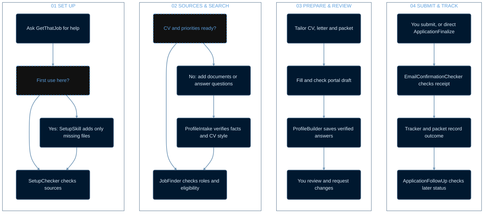

# GetThatJob

<p align="center">
  
</p>

GetThatJob is a Codex plugin for setting up a private job-search workspace, checking applicant documents, finding and assessing roles, preparing applications, building a reusable application profile, and recording verified outcomes. It carries the **workflow**, not an applicant's personal information or document design.

## How GetThatJob works

Read the four numbered panels from left to right. Each box has the same size; the paths inside the panels show the key decisions.



## Install in Codex

From this public repository, copy its GitHub URL and run:

```text
codex plugin marketplace add <repository-url>
codex plugin add get-that-job@get-that-job
```

Start a new Codex task after installation so the skills are available. Open the task in your job-search workspace, or give its full folder path in your prompt. In each example below, type `@GetThatJob` and select the installed plugin from Codex's suggestions. Codex may display the selected mention as `[@GetThatJob](plugin://get-that-job@get-that-job)`.

The setup helper uses Python 3 when available. The skills also describe a file-tool fallback for systems without Python.

### Use an existing workspace

Point GetThatJob to the existing job-search folder. It previews additions with `setup_workspace.py --workspace <path> --dry-run`, then creates only missing scaffold files and a per-workspace setup marker. Existing files are opened in create-only mode and never replaced, truncated, or removed; an existing but malformed tracker or Markdown file is reported for review rather than reset. Subsequent runs see the marker and make no setup changes. Normal job-search work can still update the applicant's tracker and notes as new verified information arrives.

## Prompts to use in Codex

Use these prompts in your own applicant workspace. Replace text in square brackets with the specific employer and role. You can keep working in the same Codex task or start another one in that workspace.

### 1. Set up or resume

```text
Use @GetThatJob to set up or resume my job-search workspace. Tell me where it is and what I need to add.
```

**Expect:** Codex tells you which folder it chose, creates only missing folders and blank records on that workspace's first use, and lists missing documents or search inputs. If the workspace already exists, it preserves its files and continues from them.

### 2. Add your documents and priorities

Put an approved CV in `CVs/`. Add credentials to `Qualifications&Certificates/` when relevant. A previous cover letter is optional.

```text
Use @GetThatJob to check the CV and credentials I added. Ask me for any search priorities you still need.
```

**Expect:** Codex checks and indexes your sources, flags missing or uncertain evidence, and asks for key role and location preferences. Tailored CVs follow *your* approved CV's style and the format required by the employer.

### 3. Find jobs and prepare drafts

```text
Use @GetThatJob and find me jobs.
```

**Expect:** Codex searches against your priorities, checks live requirements and duplicates, and explains which roles fit or fail. For a strong eligible role, it prepares the application packet and fills a checked portal draft when accessible. It stops for your review before final submission. If LinkedIn is signed out, Codex asks you to sign in through LinkedIn's official flow and can continue searching employer sites meanwhile.

### 4. Review an application

```text
Use @GetThatJob to show me the draft for [employer and role].
```

**Expect:** Codex points you to the application packet, completed draft, unanswered questions, deadline, and next action. Tell it any changes you want. After each filled and checked draft, ProfileBuilder adds newly verified reusable answers to your private `APPLICATION_PROFILE.md`; later applications check that file before asking again.

### 5. Submit a specific reviewed application

```text
Use @GetThatJob to submit my reviewed application for [employer and role].
```

**Expect:** Codex rechecks the live posting, destination, answers, documents, and duplicate status before using the final Submit control for that application. If a required e-signature or signing declaration appears, Codex needs your explicit instruction to sign that specific application. Searching and drafting do not authorize submission or signing.

### 6. Check confirmation and later status

If you submitted the application yourself, say so:

```text
I submitted my application for [employer and role]. Use @GetThatJob to check for its confirmation email.
```

**Expect:** Codex checks the connected mailbox for a matching receipt and records verified evidence in that application's packet and tracker. If there is no matching receipt or mailbox access, it tells you exactly what remains unverified.

For a later update:

```text
Use @GetThatJob to check the latest status of my [employer and role] application.
```

**Expect:** Codex checks the matching employer portal or message, reports the verified stage and next deadline, and keeps the earlier submission history.

## Add your own sources

Place at least one current, approved CV in `CVs/`. Add official credentials to `Qualifications&Certificates/` as relevant, and optionally put an approved letter example in `CoverLetters/Template/`. ProfileIntake records the applicant's facts, preferred roles, eligibility and source documents in that workspace. After each checked application draft, ProfileBuilder merges newly verified reusable form answers into the private `APPLICATION_PROFILE.md`, preserving earlier entries and their source and reuse scope. It can also capture verified answers from an application filled outside JobFinder when that application is reviewed. Later forms check the accumulated profile before asking the applicant again. The applicant's CV controls tailored CV styling; this repository contains no CV or cover-letter style template.

## Application flow

JobFinder searches LinkedIn Jobs and employer sites, verifies the live posting, checks duplicates and essential requirements, creates a tailored CV and cover letter, and fills a checked draft when accessible. ProfileBuilder then captures newly verified reusable answers. JobFinder stops for applicant review before final submission. ApplicationFinalize handles a separately authorized submission; application signing always requires explicit authorization for that specific application. EmailConfirmationChecker verifies a matching receipt, and ApplicationFollowUp records later stages when asked.

LinkedIn access is checked at use time. If the available LinkedIn app has no job-search tool, the skill uses a signed-in LinkedIn browser session. If signed out, it asks the applicant to sign in through LinkedIn's official flow and continues employer-site research while waiting. Email checking similarly uses the applicant's connected mailbox; it never sends or changes messages.

Every applicant has different qualifications, preferences, accounts and live opportunities. The plugin provides the same workflow and safeguards; job matches and application outcomes depend on those inputs and external sites.

## Privacy

Only generic templates, skills and helper scripts are distributed. Keep real CVs, credentials, the populated `APPLICATION_PROFILE.md`, application packets and access details in a separate applicant workspace. The repository's `.gitignore` blocks common accidental additions at the repository root. Review every commit before publishing.

## Development checks

Validate `plugins/get-that-job/` with Codex's plugin validator and each `skills/*/SKILL.md` with the skill validator. Test setup and checking in a synthetic temporary workspace. Review the source for private information and run `git status` before pushing. No real application needs to be submitted to test this repository.
