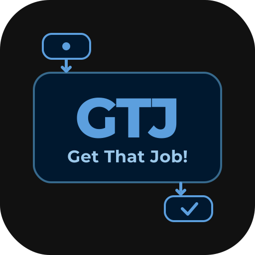
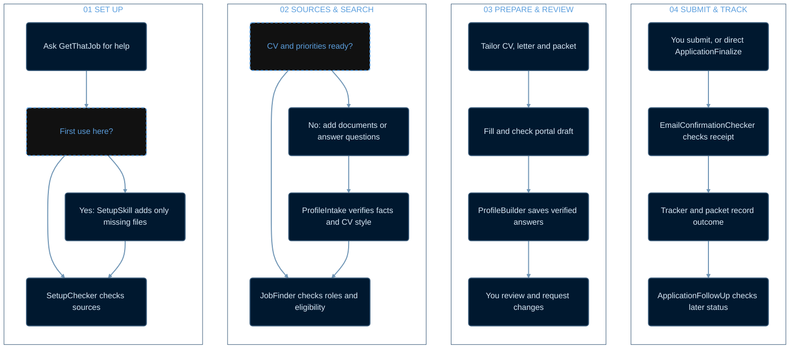

# GetThatJob

<p align="center">
  
</p>

GetThatJob is a Codex plugin for setting up a private job-search workspace, checking applicant documents, finding and assessing roles, preparing applications, building a reusable application profile, and recording verified outcomes. It carries the **workflow**, not an applicant's personal information or document design.

## How GetThatJob works

Read the four numbered panels from left to right. Each box has the same size; the paths inside the panels show the key decisions.



The [workflow page](WORKFLOW.md) explains alternate routes and repeat steps. It also offers full-resolution [horizontal](docs/workflow-detailed-horizontal.png) and [vertical](docs/workflow-detailed-vertical.png) PNGs.

## Install in Codex

From this public repository, copy its GitHub URL and run:

```text
codex plugin marketplace add <repository-url>
codex plugin add get-that-job@get-that-job
```

Start a new Codex task after installation so the skills are available. Ask: “Use GetThatJob to set up my job-search workspace.” The first use in each workspace creates folders and blank records without overwriting existing files. Later uses check the setup marker and continue from the saved state.

The setup helper uses Python 3 when available. The skills also describe a file-tool fallback for systems without Python.

### Use an existing workspace

Point GetThatJob to the existing job-search folder. It previews additions with `setup_workspace.py --workspace <path> --dry-run`, then creates only missing scaffold files and a per-workspace setup marker. Existing files are opened in create-only mode and never replaced, truncated, or removed; an existing but malformed tracker or Markdown file is reported for review rather than reset. Subsequent runs see the marker and make no setup changes. Normal job-search work can still update the applicant's tracker and notes as new verified information arrives.

## Add your own sources

Place at least one current, approved CV in `CVs/`. Add official credentials to `Qualifications&Certificates/` as relevant, and optionally put an approved letter example in `CoverLetters/Template/`. ProfileIntake records the applicant's facts, preferred roles, eligibility and source documents in that workspace. After each checked application draft, ProfileBuilder merges newly verified reusable form answers into the private `APPLICATION_PROFILE.md`, preserving earlier entries and their source and reuse scope. It can also capture verified answers from an application filled outside JobFinder when that application is reviewed. Later forms check the accumulated profile before asking the applicant again. The applicant's CV controls tailored CV styling; this repository contains no CV or cover-letter style template.

## Application flow

JobFinder searches LinkedIn Jobs and employer sites, verifies the live posting, checks duplicates and essential requirements, creates a tailored CV and cover letter, and fills a checked draft when accessible. ProfileBuilder then captures newly verified reusable answers. JobFinder stops for applicant review before final submission. ApplicationFinalize handles a separately authorized submission; application signing always requires explicit authorization for that specific application. EmailConfirmationChecker verifies a matching receipt, and ApplicationFollowUp records later stages when asked.

LinkedIn access is checked at use time. If the available LinkedIn app has no job-search tool, the skill uses a signed-in LinkedIn browser session. If signed out, it asks the applicant to sign in through LinkedIn's official flow and continues employer-site research while waiting. Email checking similarly uses the applicant's connected mailbox; it never sends or changes messages.

Every applicant has different qualifications, preferences, accounts and live opportunities. The plugin provides the same workflow and safeguards; job matches and application outcomes depend on those inputs and external sites.

## Privacy

Only generic templates, skills and helper scripts are distributed. Keep real CVs, credentials, the populated `APPLICATION_PROFILE.md`, application packets and access details in a separate applicant workspace. The repository's `.gitignore` blocks common accidental additions at the repository root. Review every commit before publishing.

## Development checks

Validate `plugins/get-that-job/` with Codex's plugin validator and each `skills/*/SKILL.md` with the skill validator. Test setup and checking in a synthetic temporary workspace. Review the source for private information and run `git status` before pushing. No real application needs to be submitted to test this repository.
