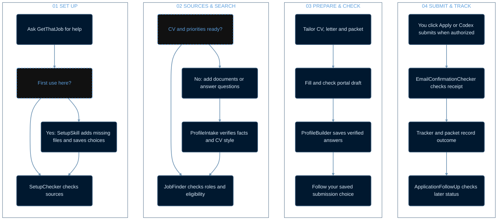

# GetThatJob

<p align="center">
  
</p>

GetThatJob is a Codex plugin for setting up a private job-search workspace, checking applicant documents, finding and assessing roles, preparing applications, building a reusable application profile, and recording verified outcomes. It carries the **workflow**, not an applicant's personal information or document design.

## How GetThatJob works

Read the four numbered panels from left to right. Each box has the same size; the paths inside the panels show the key decisions.



## Install in ChatGPT Work or Codex

### ChatGPT Work (recommended)

This is the recommended setup used to test GetThatJob. Open the ChatGPT Work project where you want to use it and send this prompt. In a workspace with plugin installation enabled, ChatGPT Work handles the installation and guides you through any access step your account requires.

```text
Install the following plugin: [https://github.com/YazanMahaini/GetThatJob](https://github.com/YazanMahaini/GetThatJob)
```

### Codex

Install the plugin from this repository:

```text
codex plugin marketplace add https://github.com/YazanMahaini/GetThatJob
codex plugin add get-that-job@get-that-job
```

Start a new Codex task after installation so the skills are available. Open the task in your job-search workspace, or give its full folder path in your prompt. Type `@GetThatJob` and select the installed plugin from Codex's suggestions. Codex may display the selected mention as `[@GetThatJob](plugin://get-that-job@get-that-job)`.

The setup helper uses Python 3 when available. The skills also describe a file-tool fallback for systems without Python.

## Start with one prompt

In your applicant workspace, select the `@GetThatJob` plugin mention and send:

```text
Use @GetThatJob and find me jobs.
```

That request starts or resumes the pipeline. GetThatJob handles these tasks in sequence:

1. **Set up and check the workspace.** On first use in that workspace, it creates only missing folders and blank records. It preserves existing files, checks available CVs and credentials, asks once for your email plugin and submission preference, and identifies any missing search priorities. If your CVs have different designs, it asks which of your own CVs should set the style.
2. **Find and assess jobs.** It searches LinkedIn Jobs and employer sites, checks live requirements, eligibility, and duplicates, and records why a role fits or fails. If LinkedIn needs sign-in, it asks you to use LinkedIn's official flow while it continues employer-site research.
3. **Prepare strong applications.** For a strong eligible role, it uses verified information from your approved CVs and follows your chosen CV design, creates a tailored CV, cover letter, and application packet, and fills and checks a portal draft when accessible.
4. **Build your reusable profile.** After each filled and checked draft, ProfileBuilder saves newly verified reusable answers in your private `APPLICATION_PROFILE.md`. Later applications check that file before asking you the same question again.
5. **Follow your saved submission choice.** By default, Codex gives you the checked draft and stops so you can click Apply yourself or tell it to submit that application. If you chose automatic submission, it rechecks and submits a complete application without asking again, unless a required fact, signature, or other blocker needs you.

### Use an existing workspace

Point GetThatJob to the existing job-search folder. It previews additions with `setup_workspace.py --workspace <path> --dry-run`, then creates only missing scaffold files and a per-workspace setup marker. Existing files are opened in create-only mode and never replaced, truncated, or removed; an existing but malformed tracker or Markdown file is reported for review rather than reset. Subsequent runs see the marker and make no setup changes. Normal job-search work can still update the applicant's tracker and notes as new verified information arrives.

## Add your own sources

Place at least one current, approved CV in `CVs/`. Add official credentials to `Qualifications&Certificates/` as relevant, and optionally put an approved letter example in `CoverLetters/Template/`. ProfileIntake records the applicant's facts, preferred roles, eligibility and source documents in that workspace. After each checked application draft, ProfileBuilder merges newly verified reusable form answers into the private `APPLICATION_PROFILE.md`, preserving earlier entries and their source and reuse scope. It can also capture verified answers from an application filled outside JobFinder when that application is reviewed. Later forms check the accumulated profile before asking the applicant again. A CV from this applicant controls tailored CV styling; this repository contains no CV or cover-letter style template.

## When Codex needs you

You can start with one request and let GetThatJob do the work. It will pause and tell you exactly what it needs when only you can provide it. That might be a CV, proof of a qualification, your preferred kinds of jobs, an answer missing from your documents, a website sign-in, or your review of a completed application. Reply in the same conversation; it will pick up where it stopped and keep doing any other available work meanwhile.

On first setup, it asks which email plugin you use. Select its `@` mention, such as `@Outlook Email` or `@Gmail`. GetThatJob remembers your choice for this private workspace, so you do not have to repeat it later. If the plugin is not connected yet, the job search can continue; email confirmation checks will wait until it is connected.

It also asks whether to **stop after filling and checking each application** or **submit complete applications automatically**. The default is to stop and let you click Apply yourself. You can instead tell Codex to submit a particular checked application. GetThatJob remembers this choice until you tell it to change it. Even with automatic submission, it will ask you before signing anything, paying a fee, or answering a question it cannot verify.

If you add several CVs with different designs, GetThatJob asks you to pick one of **your CVs** as the design to follow. This controls how tailored CVs look. It still reads all your approved CVs for information, so choosing a design does not discard experience or skills recorded in another version. If you have one CV, or your CVs share the same design, no choice is needed.

After reviewing a checked draft in the default mode, tell Codex any revisions you want. If you want it to submit that application, say: `Use @GetThatJob to submit my reviewed application for [employer and role].` It rechecks the application before submission. An e-signature or signing declaration requires a separate, explicit instruction for that specific application.

If you click Apply yourself, continue in the same GetThatJob task with either prompt:

```text
I applied, check email.
```

```text
Submitted. Check email and confirm.
```

GetThatJob routes these to EmailConfirmationChecker. It identifies the application from your recent tracker and packet when there is one clear match; if several are plausible, it asks which employer and role you mean. It uses your selected email plugin to look for a matching receipt and records only what the evidence confirms. You can ask for a later status check when you want one.

## Tips

- Put a comprehensive **master CV** containing all your experience in `CVs/`, or add **all your approved CV versions** there. GetThatJob reads each one and records its supported information in your private workspace, whether you supply one CV or several. If two versions disagree, it flags the difference for you instead of guessing.
- **Recommended model:** GetThatJob works best with **GPT-6 Sol** at **Extra High** reasoning (`xhigh`). Select these settings in Codex for results closest to the workflow documented here.

## Application flow

JobFinder searches LinkedIn Jobs and employer sites, verifies the live posting, checks duplicates and essential requirements, creates a tailored CV and cover letter, and fills a checked draft when accessible. ProfileBuilder then captures newly verified reusable answers. The saved submission mode determines whether JobFinder stops for the applicant or passes a complete checked draft to ApplicationFinalize for automatic submission. Application signing always requires explicit authorization for that specific application. EmailConfirmationChecker verifies a matching receipt, and ApplicationFollowUp records later stages when asked.

LinkedIn access is checked at use time. If the available LinkedIn app has no job-search tool, the skill uses a signed-in LinkedIn browser session. If signed out, it asks the applicant to sign in through LinkedIn's official flow and continues employer-site research while waiting. Email checking uses the plugin selected for that workspace; it only reads matching messages and never sends or changes them.

Every applicant has different qualifications, preferences, accounts and live opportunities. The plugin provides the same workflow and safeguards; job matches and application outcomes depend on those inputs and external sites.

## Privacy

Only generic templates, skills and helper scripts are distributed. Keep real CVs, credentials, the populated `APPLICATION_PROFILE.md`, application packets and access details in a separate applicant workspace. The repository's `.gitignore` blocks common accidental additions at the repository root. Review every commit before publishing.

## Development checks

Validate `plugins/get-that-job/` with Codex's plugin validator and each `skills/*/SKILL.md` with the skill validator. Test setup and checking in a synthetic temporary workspace. Review the source for private information and run `git status` before pushing. No real application needs to be submitted to test this repository.
