# GetThatJob workflow

The diagram shows how one applicant workspace moves from first setup through a recorded application outcome.

```mermaid
flowchart LR
    A("Ask GetThatJob for help") --> B("First use in this workspace?")
    B -- Yes --> C("SetupSkill creates folders and tracking files")
    B -- No --> D("SetupChecker checks what's available")
    C --> D
    D --> E("CV and search priorities ready?")
    E -- No --> F("You add documents or answer key questions")
    F --> G("ProfileIntake records verified facts and your document style")
    G --> D
    E -- Yes --> H("JobFinder searches LinkedIn Jobs and employer sites, checks eligibility, and asks for sign-in if needed")
    H --> I("Creates a tailored application packet")
    I --> J("Fills and checks a portal draft when accessible")
    J --> P("ProfileBuilder adds verified reusable answers to the private profile")
    X("Checked application filled outside JobFinder") --> P
    P --> K("You review")
    K -- Revisions --> I
    K -- You submit --> M("EmailConfirmationChecker looks for a matching receipt")
    K -- You ask it to submit --> L("ApplicationFinalize checks and submits the specific application")
    L --> M
    M --> N("Application tracker and packet record the outcome")
    N --> O("ApplicationFollowUp checks later status when requested")
    O --> N
    N -.->|Next role reuses confirmed answers| H

    classDef step fill:#00182f,stroke:#244766,color:#5c9fde,stroke-width:2px;
    classDef decision fill:#111111,stroke:#5c9fde,color:#5c9fde,stroke-width:2px,stroke-dasharray:5 4;
    class A,C,D,F,G,H,I,J,P,X,K,L,M,N,O step;
    class B,E decision;
    linkStyle default stroke:#777777,stroke-width:1.5px;
```

The workspace contains `CVs/`, `CoverLetters/`, `Qualifications&Certificates/`, `applications/`, `APPLICATION_PROFILE.md`, and the other Markdown and CSV source indexes. Setup runs once per applicant workspace. A search request may authorize filling a reversible draft; final submission and application signing have separate authorization boundaries. Later follow-up is recorded in the same application packet.
