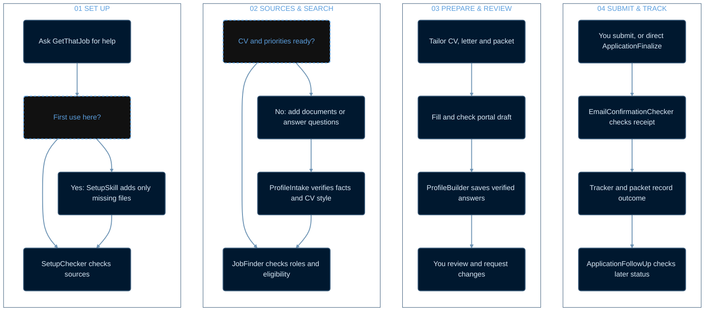
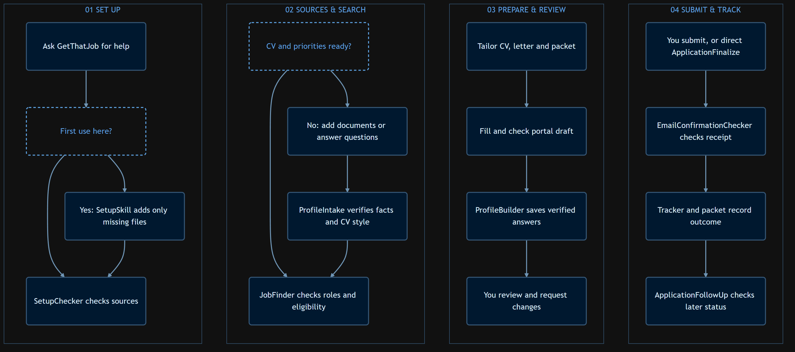
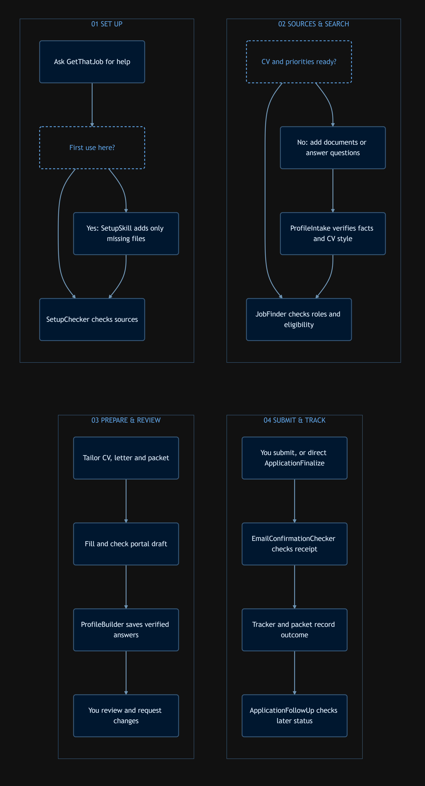

# GetThatJob workflow

This interactive diagram groups the pipeline from workspace setup through a recorded application outcome. Read the numbered panels from left to right. Use GitHub's diagram controls to zoom and pan.

## Detailed decisions and branches

If LinkedIn is signed out, the applicant signs in through LinkedIn's official flow while other research can continue. After missing sources are added, SetupChecker runs again. Revisions return to the application packet. ProfileBuilder also accepts verified answers from a checked application filled outside JobFinder. Each later application reads the growing private profile and rechecks role-specific facts. Follow-up updates the same tracker and packet.

## Full-resolution PNGs

- [Horizontal detailed workflow (3136 × 1392 pixels)](docs/workflow-detailed-horizontal.png)
- [Vertical detailed workflow (3136 × 5792 pixels)](docs/workflow-detailed-vertical.png)

Preview the horizontal PNG

Preview the vertical PNG

The workspace contains `CVs/`, `CoverLetters/`, `Qualifications&Certificates/`, `applications/`, `APPLICATION_PROFILE.md`, and the other Markdown and CSV source indexes. Setup runs once per applicant workspace. A search request may authorize filling a reversible draft; final submission and application signing have separate authorization boundaries. Later follow-up is recorded in the same application packet.
